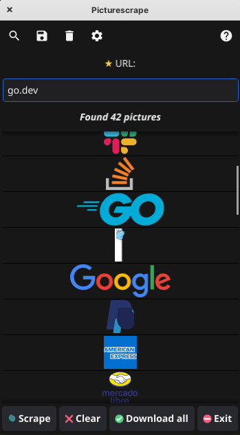
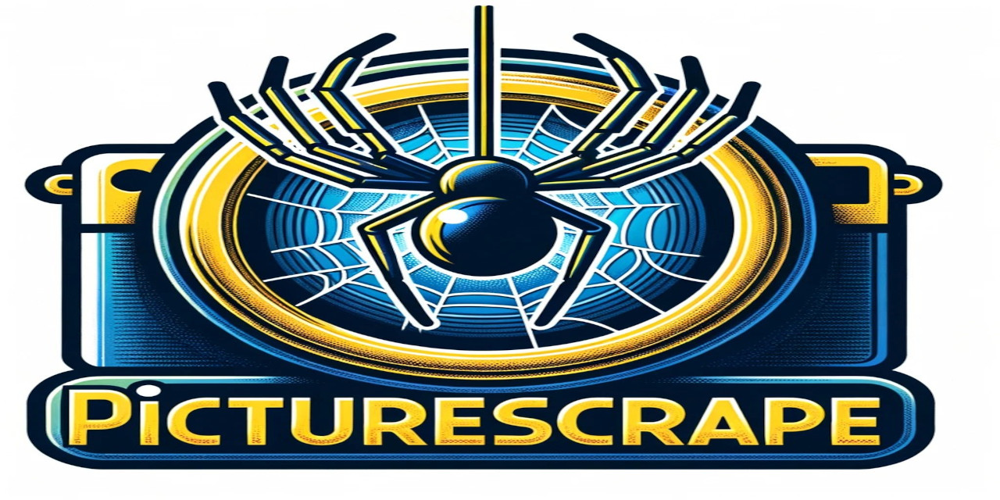

<p align="center">
  
</p>

# Picturescrape

Picturescrape is a desktop application written in Go using the Fyne toolkit, designed to scrape and download images from specified URLs.
Releases for Linux, Android and Windows.

## Features

- Scrape images from any given URL.
- Preview images within the application.
- Download individual or all scraped images.
- Filter and remove duplicate images.
- Simple and intuitive GUI.

<p align="center">
  
</p>

## Prerequisites

Before you begin, ensure you have met the following requirements:

- Go version 1.16 or above is installed.
- Fyne toolkit is installed.
- Colly web scraping framework is installed.

## Installation

Clone the repository to your local machine:

```bash
git clone https://github.com/lennart1978/picturescrape.git
```
Navigate to the project directory:

```bash
cd picturescrape
```
Build the application:
```bash
go build .
```
Run the application
```bash
./picturescrape
```
## Usage
- Enter the URL you want to scrape images from in the input field.
- Click on the 'Scrape' button to start scraping images.
- Preview the scraped images in the list below.
- Select an image to download it, or use the 'Download all' button to download all images.
- Adjust the image size using the slider if necessary.

## License
This project is licensed under the MIT License - see the LICENSE file for details.

## Acknowledgments
- Colly for providing the scraping framework.
- Fyne for the user-friendly GUI toolkit.
<p align="center">
  
</p>
